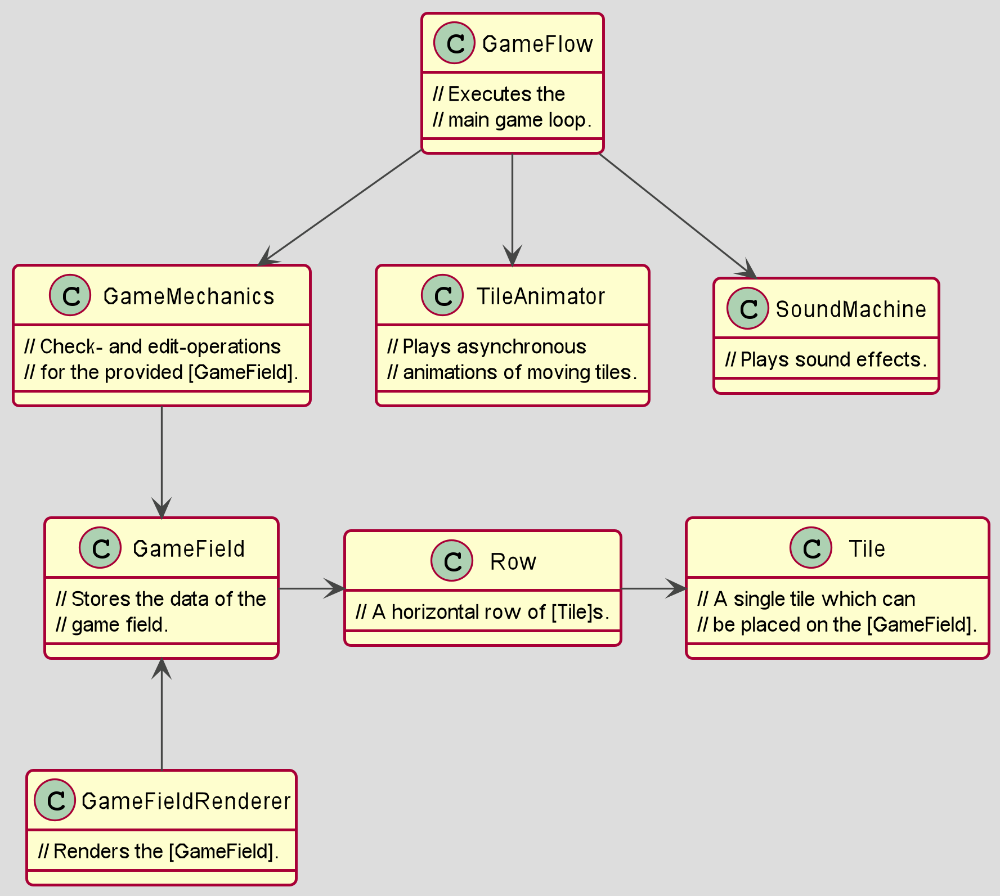
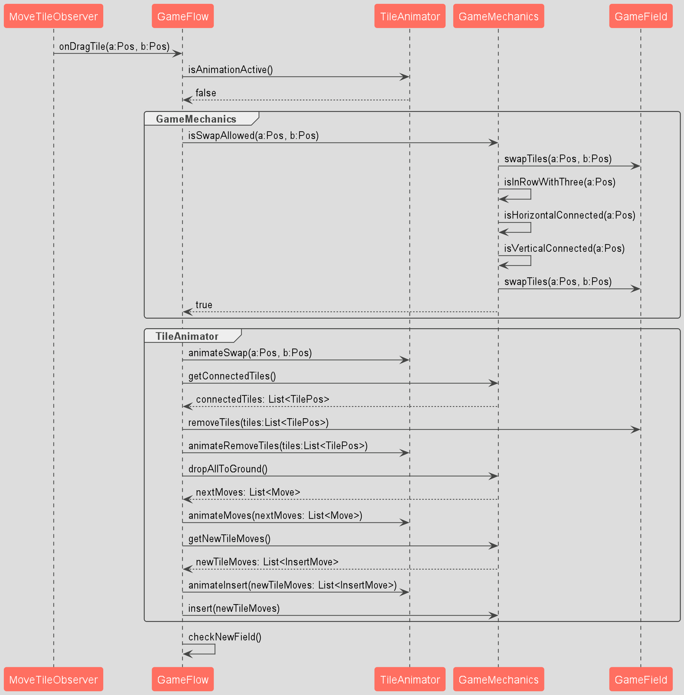

#  Candy Crush Clone
[](http://kotlinlang.org)
[](https://korge.org)
[](https://gradle.org)
[](https://github.com/KotlinBy/awesome-kotlin)

[](https://tobsef.github.io/Candy-Crush-Clone/)

> 🚧 This is a *work in progress* match 3 game. It's ready to play but also a clean and simple example for Kotlin multiplatform game development with 
> [KorGE](https://korge.org). In addition, it includes a test driven step-by-step guide for learning the game mechanics. Originally designed for a workshop on the 
> [JavaLand4Kids](https://www.javaland.eu/de/javaland-2018/javaland4kids/).

### [🎮 Run the game as WebApp](https://tobsef.github.io/Candy-Crush-Clone/)

## ⭐ Features
⭐ Cross-platform  
⭐ Touch controls  
⭐ Support for custom skins  
⭐ Tested and documented  
⭐ Build to teach

## 💿 Downloads

### 📦 [Candy-Crush-Clone-1.1.0_win.zip](https://github.com/TobseF/Candy-Crush-Clone/releases/download/1.1.0/Candy-Crush-Clone-1.1.0_win.zip) `9.81 MB` [Windows]
> 💡 Native x64 one-click exe - No Java required.

### 📦 [Candy-Crush-Clone-1.1.0_jar.zip](https://github.com/TobseF/Candy-Crush-Clone/releases/download/1.1.0/Candy-Crush-Clone-1.1.0_jar.zip) `17,20 MB` `17.2 MB` [Platform independent]
> 💡  Requires an installed [Java JRE](https://java.com/en/download/). Runs on Windows, Linux & Mac.

### 📱 [Candy-Crush-Clone-1.1.0.apk](https://github.com/TobseF/Candy-Crush-Clone/releases/download/1.1.0/Candy-Crush-Clone-1.1.0.apk) `9,46 MB` [Android App]
> 💡 Should run on every Android with at least 4.1 Jelly Bean. 

### 🌎 [Candy-Crush-Clone-1.1.0_web.zip](https://github.com/TobseF/Candy-Crush-Clone/releases/download/1.1.0/Candy-Crush-Clone-1.1.0_web.zip) `7,70 MB` [Web App]
> 💡 To run the downloaded webapp, start a webserver in the extracted folder.

## ⌨ Controls

Click and drag a candy onto another neighbor to get a row of minimum 3 tiles. 


Keys controls are only for debugging purpose:
* <kbd>H7</kbd> Switch to debug mode.
* <kbd>P</kbd> **P**rint game field data. 
* <kbd>D</kbd> Toggle tiles with **d**ebug letters.
* <kbd>S</kbd> **S**huffle game field.
* <kbd>R</kbd> **R**eload level.
* <kbd>I</kbd> Print **I**mage data.

---

## 👨‍🏫 Workshop
If you want to do the workshop check out the branch `Javaland4Kids`. In this state the game logic is missing and needs
to be implemented. Therefore, the tests are separated into 8 easy steps (`step1` - `step8`). Each step contains several
tests. Code until a step is running green:
```bash
./gradlew  jvmTest
```
After every step, you can run the game to check your progress. 
```bash
./gradlew  runJvm
```

## 🧭 Overview
The game runs in a game loop in the `GameFlow`.
The game logic and the model are separated from the rendering.
This allows to test the game without a UI.
A `EventBus` helps to decouple the components.
For easy dependency injection the `AsyncInjector` is used.

### Class Diagram

### Game Flow


## 🛠 Setup

You can open this project in IntelliJ IDEA by opening the folder or the `build.gradle.kts` file.
For Windows, change all the `./gradlew` for `gradlew.bat`.
You should use Gradle 7.5 or greater and Java 8 or greater.

To upgrade to a newer KorGE, change the plugin version in `gradle/libs.versions.toml`.

## 🔊 Audio

To mute sounds you can change `src/commonMain/kotlin/main.kt` and set `playSounds = false`.
Sounds and music can be also enabled in the game settings (⚙ gear icon).

## 📜 MIT Licence

Permission is hereby granted, free of charge, to any person obtaining a copy
of this software and associated documentation files (the "Software"), to deal
in the Software without restriction, including without limitation the rights
to use, copy, modify, merge, publish, distribute, sublicense, and/or sell
copies of the Software, and to permit persons to whom the Software is
furnished to do so.

Some game resources are not included in this MIT licence and provided by others. Please respect their royalty:

* 🎵 The optional game music is provided by [_Eric Matyas_](https://soundimage.org/sample-page/)
  and licensed under the [Soundimage International Public License](https://soundimage.org/sample-page/).
* 🖼 Background image and candy graphics are from [stockunlimited](https://www.stockunlimited.com/)
  used with the [Stockunlimited Content License - Standard](https://www.stockunlimited.com/license.php).
* 🖼 GUI buttons are [Chocolate Candy bundle](https://www.gameart2d.com/chocolate-candy-game-gui.html) from Game Art 2D
  used with the [Paid Assets License](https://www.gameart2d.com/license.html).
* The bitmap font is based on the [Candice Font](https://fonts2u.com/candice.font) _Copyright 1992 by URW Software_.

## Compiling for the JVM (Desktop)

Inside IntelliJ you can go to the `src/commonMain/kotlin/main.kt` file and press the green ▶️ icon
that appears to the left of the `suspend fun main()` line.

Using gradle tasks on the terminal:

```bash
./gradlew runJvm                    # Runs the program
./gradlew packageJvmFatJar          # Creates a FAT Jar with the program
./gradlew packageJvmFatJarProguard  # Creates a FAT Jar with the program and applies Proguard to reduce the size
```

Fat JARs are stored in the `/build/libs` folder.

## Compiling for the Web

Using gradle tasks on the terminal:

```bash
./gradlew jsWeb                     # Outputs to /build/web
./gradlew jsWebMin                  # Outputs to /build/web-min (applying Dead Code Elimination)
./gradlew jsWebMinWebpack           # Outputs to /build/web-min-webpack (minimizing and grouping into a single bundle.js file)
./gradlew runJs                     # Outputs to /build/web, creates a small http server and opens a browser
```

You can use any HTTP server to serve the files in your browser.
For example using: `npm -g install http-server` and then executing `hs build/web`.

You can also use `./gradlew -t jsWeb` to continuously building the JS sources and running `hs build/web` in another terminal.
Here you can find a `testJs.sh` script doing exactly this for convenience.

You can run your tests using Node.JS by calling `jsTest` or in a headless chrome with `jsTestChrome`.

## Compiling for Native Desktop (Windows, Linux and macOS)

Using gradle tasks on the terminal:

```bash
./gradlew linkDebugExecutableMacosX64         # Outputs to /build/bin/macosX64/mainDebugExecutable/main.kexe
./gradlew linkDebugExecutableLinuxX64         # Outputs to /build/bin/linuxX64/mainDebugExecutable/main.kexe
./gradlew linkDebugExecutableMingwX64         # Outputs to /build/bin/mingwX64/mainDebugExecutable/main.exe
```

Note that windows executables doesn't have icons bundled.
You can use [ResourceHacker](http://www.angusj.com/resourcehacker/) to add an icon to the executable for the moment.
Later this will be done automatically.

### Cross-Compiling for Linux/Windows

If you have docker installed, you can generate native executables for linux and windows
using the cross-compiling gradle wrappers:

```bash
./gradlew_linux linkDebugExecutableLinuxX64   # Outputs to /build/web
./gradlew_win   linkDebugExecutableMingwX64   # Outputs to /build/web
```

### Generating MacOS `.app`

```bash
./gradlew packageMacosX64AppDebug             # Outputs to /build/unnamed-debug.app
```

You can change `Debug` for `Release` in all the tasks to generate Release executables.

You can use the `strip` tool from your toolchain (or in the case of windows found in the ``~/.konan` toolchain)
to further reduce Debug and Release executables size by removing debug information (in some cases this will shrink the EXE size by 50%).

In windows this exe is at: `%USERPROFILE%\.konan\dependencies\msys2-mingw-w64-x86_64-gcc-7.3.0-clang-llvm-lld-6.0.1\bin\strip.exe`.

### Linux notes

Since linux doesn't provide standard multimedia libraries out of the box,
you will need to have installed the following packages: `freeglut3-dev` and `libopenal-dev`.

In ubuntu you can use `apt-get`: `sudo apt-get -y install freeglut3-dev libopenal-dev`.

## Compiling for Android

You will need to have installed the Android SDK in the default path for your operating system
or to provide the `ANDROID_SDK` environment variable. The easiest way is to install Android Studio.

Using gradle tasks on the terminal:

### Native Android (JVM)

```bash
./gradlew installAndroidDebug             # Installs an APK in all the connected devices
./gradlew runAndroidEmulatorDebug         # Runs the application in an emulator
```

Triggering these tasks, it generates a separate android project into `build/platforms/android`.
You can open it in `Android Studio` for debugging and additional tasks. The KorGE plugin just
delegates gradle tasks to that gradle project.

### Apache Cordova (JS)

```bash
./gradlew compileCordovaAndroid           # Just compiles cordova from Android
./gradlew runCordovaAndroid               # Runs the application (dce'd, minimized and webpacked) in an Android device
./gradlew runCordovaAndroidNoMinimized    # Runs the application in Android without minimizing (so you can use `chrome://inspect` to debug the application easier)
```


## Compiling for iOS

You will need XCode and to download the iOS SDKs using Xcode.

Using gradle tasks on the terminal:

### Native iOS (Kotlin/Native) + Objective-C

Note that the necessary bridges are built using Objective-C instead of Swift, so the application
won't include Swift's runtime.

```bash
./gradlew iosBuildSimulatorDebug          # Creates an APP file
./gradlew iosInstallSimulatorDebug        # Installs an APP file in the simulator
./gradlew iosRunSimulatorDebug            # Runs the APP in the simulator

```

These tasks generate a xcode project in `build/platforms/ios`, so you can also open the project
with XCode and do additional tasks there.

It uses [XCodeGen](https://github.com/yonaskolb/XcodeGen) for the project generation
and [ios-deploy](https://github.com/ios-control/ios-deploy) for deploying to real devices.

### Apache Cordova (JS)

```bash
./gradlew compileCordovaIos               # Just compiles cordova from iOS
./gradlew runCordovaIos                   # Runs the application (dce'd, minimized and webpacked) in an iOS device
./gradlew runCordovaIosNoMinimized        # Runs the application in iOS without minimizing (so you can use Safari on macOS to debug the application easier)
```

## JS-game deployment to GitHub Pages

- Go to [settings page](../../settings) and enable GitHub Pages
- Choose branch `github-pages` and select folder `/ (root)`
- After that you can use link:  
  [link to JS-game](../../deployments/activity_log?environment=github-pages), click "View Deployment"
- When you push to main or master branch, - deployment process will start again with GitHub Actions.  

